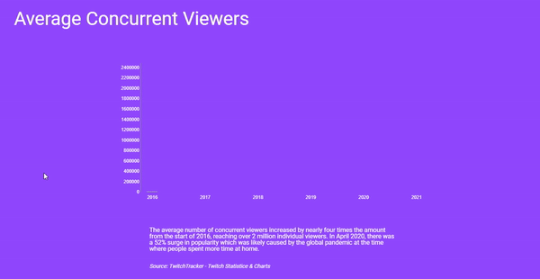
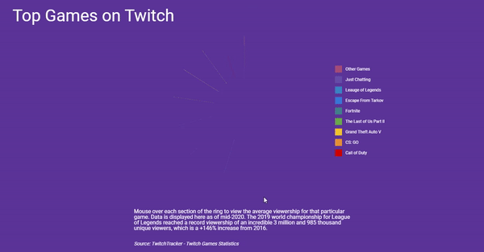

# Twitchalytics

Twitchalytics is an online application that showcases the statistics of the popular streaming website known as Twitch. You can view the live version [here.](https://dunderproto.github.io/Twitchalytics/)

## Technologies
- HTML 5
- CSS 3
- JavaScript
- D3.js
- Webpack (4.43.0)

## Features

### Average Concurrent Viewers
- The average number of concurrent viewers is displayed on a bar graph divided by each quarter of the year. All animations and visuals were created with D3.js, including the tooltip that shows up when a bar is hovered over. 



- Each bar in the graph is loaded sequentially creating a wave-like animation effect, and hovering over a single bar will display a tooltip that details the average viewership of that month. The logic is stored inside of a function which will then trigger once the user scrolls down to the this graph.

*Average Concurrent Viewership Graph*
```javascript
    const loadBars = (sections) => {
        sections.enter().append('rect')
            .classed('bar', true)
            .attr('width', 28)
            .attr('x', function(d, i) {return ((i+0.45) * 34);})
            .attr('y', function(d) {return height - 100;})
            .on('mouseenter', function(d) {
                d3.select('.viewer-tooltip')
                    .style('opacity', 1)
                    .style('left', event.target.getBoundingClientRect().x - 70 + 'px')
                    .style("top",  event.target.getBoundingClientRect().y - 95 + "px")
                    .html(barToolTip(d))
            })
            .on('mouseleave', function(d) {
                d3.select('.viewer-tooltip')
                    .style('opacity', 0)
            })
            .transition().delay(function(d, i) {return i*65})
            .duration(500)
            .attr('height', function(d) {return height - 60 - yScale(+d.Viewers)})
            .attr('y', function(d) {return yScale(+d.Viewers) - 40;})
    }
```

*Trigger Animation on Scroll*
```javascript
    if (window.scrollY >= 1400) {
        loaded = true;
        loadBars(bars);
    }

    window.addEventListener('scroll', function() {
        if (window.scrollY >= 1400 && loaded == false) {
            loaded = true;
            loadBars(bars);
        }
    })
```

### Top Games on Twitch
- The most popular games at this point in time is displayed in a ring-like graph also created with D3.js. A legend with colors indicated each game is also displayed to the side of the graph.



- Hovering over each section of the graph will enlarge it and exhibit the percentage, number of viewers and the game title.

*Top Games Graph*
``` javascript
const loadDonut = () => {
    svg.selectAll('path')
        .data(pie(data))
        .enter()
        .append('path')
        .style('fill', function(d, i){
            return color(d.data.Game);
        })
        .on("mouseenter", function (d) {
            d3.select(this)
                .style('cursor', 'pointer')
                .attr("stroke", "white")
                .transition()
                .duration(100)
                .attr("d", arcOver)
                .attr("stroke-width", 1);
            
            d3.select('.game-tooltip')
                .style('opacity', 1)
                .style("top",  '10px')
                .style('left', '0px')
                .html(gameToolTip(d))
        })
        .on("mouseleave", function (d) {
            d3.select(this).transition()
                .duration(200)
                .attr("d", arc)
                .attr("stroke", "none");

            d3.select('.game-tooltip')
                .style('opacity', 0)
        })
        .attr('transform', 'translate(0, 50)')
        .transition().delay(function(d,i) {
            return 190; }).duration(500)
            .attrTween('d', function(d) {
            var i = d3.interpolate(d.startAngle, d.endAngle);
            return function(t) {
                d.endAngle = i(t); 
                return arc(d)
            }
        })
}
```

## Future Features
- Languages 
    - Along with top games, most popular languages will also be shown
- Twitch Growth
    - Trends and the growth of Twitch displayed with an interactive line graph